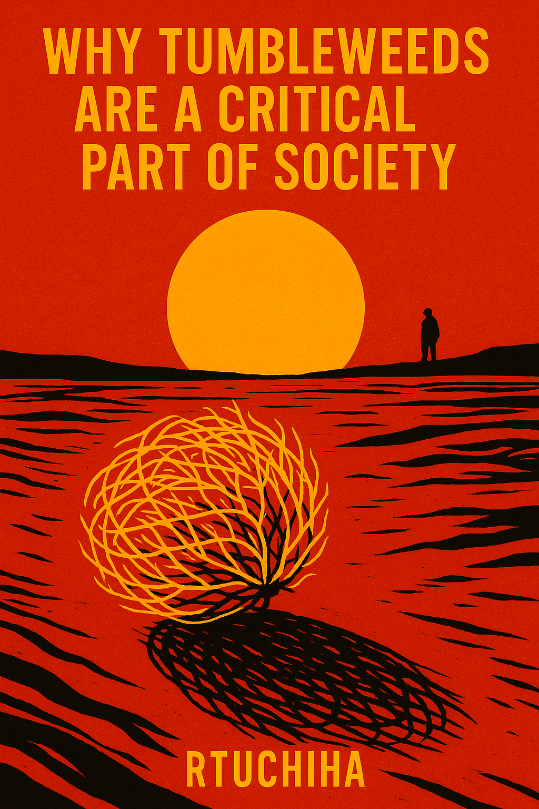

# Why Tumbleweeds Are a Critical Part of Society  
*by RTUchicha*

Tumbleweeds are not just useless balls of dead grass that roll dramatically across abandoned towns in every western movie ever made. (Except the fact that they are…) They are critical pillars of society, bravely reminding us that even nature can give up sometimes. Without tumbleweeds, we would have no idea when to dramatically squint into the distance or feel existential dread in the middle of a desert.  

## 1. Free, Environmentally Friendly Alarm Systems  
If you ever see a tumbleweed rolling across your front lawn, congratulations: something has gone terribly wrong. It’s nature’s way of saying, “Hey, maybe move.” Tornado incoming? Tumbleweed. Zombie apocalypse? Tumbleweed. Your class found out you still sleep with a nightlight? Tumbleweed. Their warning system is subtle, yet deeply effective for those wise enough to pay attention.  

## 2. Vital Support to Lonely Creatives  
Tumbleweeds provide indispensable assistance to photographers and filmmakers. Without them, how would artists show that a town is completely abandoned without hiring, like, fifty actors to stand around looking bored? Tumbleweeds work for free, they don’t need lunch breaks, and they don’t ask for royalties. They are noble workers.  

## 3. Heavy-Hitting Symbolism  
Tumbleweeds represent the aimless wandering of humanity through an unforgiving landscape—which sounds super deep until you realize they’re just plants that gave up and decided to roll with it.  

## Conclusion  
Tumbleweeds deserve our utmost respect. They are dramatic, slightly pathetic, and confusing—just like us. Next time you see a tumbleweed sadly bouncing across the street, salute it. It’s doing its best.
